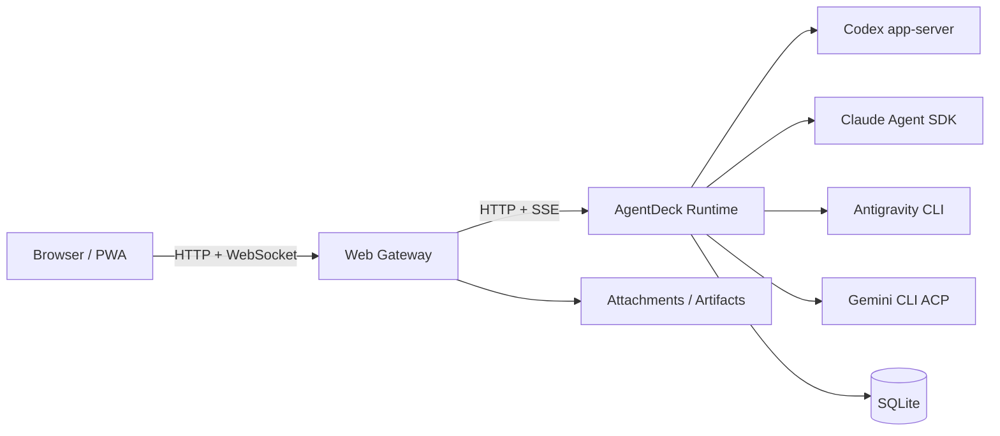

<div align="center">

# AgentDeck

**在浏览器和手机上，继续运行在服务器里的 Coding Agent。**

统一使用 Codex、Claude Code 和其他 CLI Agent。
关掉页面、换台设备，任务和会话仍然留在自己的服务器上。


</div>

---

## 它是做什么的？

Coding Agent 很适合放在服务器里工作，但终端并不适合一直带在身边。

AgentDeck 给这些 CLI 加了一个适合电脑和手机使用的控制台。你可以在电脑上发起任务，离开以后从手机查看进度、补充附件、处理审批，再回到电脑继续。

Agent 仍然运行在你自己的服务器上。AgentDeck 不托管你的代码，也不会把项目变成某个平台里的副本。

## 主要功能

- 在桌面和手机之间继续同一个会话；
- 统一管理多个 Agent、账户和工作区；
- 上传图片、源码、PDF 和其他附件；
- 查看运行过程，处理审批或随时停止任务；
- 页面刷新、断线或 Web 服务重启后恢复已经保存的内容；
- 通过 PWA 像普通应用一样打开；
- 所有项目、凭据和运行数据都留在自己的机器上。

## Provider

| Provider | 说明 |
| --- | --- |
| **Codex** | 当前最完整的接入，支持持久会话、审批、附件和多账户。 |
| **Claude Code** | 通过官方 CLI 登录和 Claude Agent SDK 运行。 |
| **Antigravity** | 提供基础 CLI Agent 支持，能力取决于上游。 |
| **Gemini CLI** | 实验性支持；个人账户目前可能受上游限制，不建议作为主要 Provider。 |

打开 AgentDeck 后，可以在 Provider 设置中查看 CLI 状态、安装受支持的 CLI，并完成登录。

## 快速开始

需要一台 Linux 服务器，以及 Node.js 22 或更高版本。

推荐把 AgentDeck 放在 localhost、LAN、VPN、Tailscale、Headscale 或 WireGuard 后面使用。不要把未加防护的 AgentDeck 直接暴露到公网。

```bash
git clone https://github.com/razuberiii/agentdeck.git
cd agentdeck
sudo AGENTDECK_INSTALL_PROFILE=standard ./install.sh
```

安装完成后，脚本会打印访问地址和下一步操作。

打开 AgentDeck，进入 **设置 → Provider**，登录你要使用的 Agent，然后就可以创建任务。

已有 ubuntu/full-access/VPN 部署可以继续使用 personal profile：

```bash
sudo AGENTDECK_INSTALL_PROFILE=personal ./install.sh
```

安装 profile：

| Profile | 适合谁 | 默认行为 |
| --- | --- | --- |
| `personal` | 个人、localhost、VPN、可信内网 | 保持原来的爽用体验：ubuntu 用户、Codex `danger-full-access`、`approval_policy=never`。 |
| `standard` | 新的自托管用户 | 使用专用 `agentdeck` 用户，Codex 默认 `workspace-write` + `on-request`。 |
| `hardened` | 熟悉 Linux/systemd 的高级用户 | 更保守的基础框架，Codex 默认 `read-only` + `on-request`。 |

更多安装说明见 [`docs/install.md`](docs/install.md)。

## 架构



浏览器只是控制界面。

真正的会话、活动任务、Provider session 和事件序列保存在 Runtime 中。页面重新连接时，会补回已经持久化的事件，而不是从头开始。

## 常用命令

```bash
# 查看状态
sudo agentdeckctl status

# 检查环境
sudo agentdeckctl check

# 部署当前代码
sudo agentdeckctl deploy all

# 查看部署任务
sudo agentdeckctl jobs

# 回滚
sudo agentdeckctl rollback all
```

涉及 Runtime 的部署会等待正在运行的任务结束，再安全切换版本。

更详细的部署、备份和排错说明见 [`docs/`](docs/)。

## 本地开发

```bash
npm ci
npm run start:local
```

检查项目：

```bash
npm run typecheck
npm run lint
npm run build
npm test
npm run test:e2e
```

## 项目状态

AgentDeck 仍在持续开发中。不同 Provider 的 CLI 和协议可能变化，部分能力也并不完全一致。

发现问题可以直接提交 Issue。

## License

[MIT](LICENSE)
