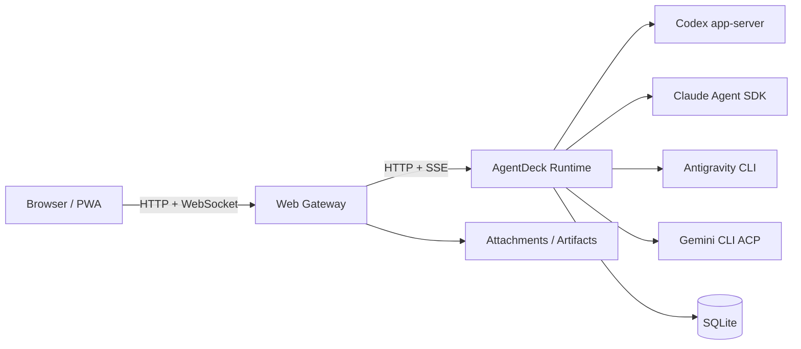

<div align="center">

# AgentDeck

**把服务器上的 Coding Agent，装进一个随时能打开的控制台。**

在浏览器或手机上使用 Codex、Claude Code、Antigravity 和 Gemini CLI。  
Agent 继续运行在你的服务器上，页面关掉了也没关系。


</div>

---

## 为什么做 AgentDeck

Coding Agent 很好用，但终端不适合一直带在身边。

我想在电脑上发起任务，离开以后还能从手机查看进度、补一句话、处理审批；也不想为了切换 Codex、Claude 或 Gemini，来回找不同的命令和配置目录。

所以有了 AgentDeck：

> CLI 负责真正干活，AgentDeck 负责把它们放到同一个界面里，并记住正在发生的事情。

## 它能做什么

- 在电脑和手机之间继续同一个任务；
- 管理多个 Provider、账户和项目；
- 上传图片、源码、PDF 和其他附件；
- 查看运行过程、审批工具调用、停止任务；
- 页面刷新或短暂断线后恢复已经保存的内容；
- 所有代码、凭据和运行数据都留在自己的服务器上。

## Provider

界面中的顺序固定为：

**Codex → Claude Code → Antigravity → Gemini**

| Provider | 接入方式 | 状态 |
| --- | --- | --- |
| **Codex** | Codex app-server | 完整的会话、流式事件、审批、附件和多账户支持 |
| **Claude Code** | Claude Agent SDK + 官方 CLI 登录 | 流式输出、工具调用、审批、附件、停止和 session resume |
| **Antigravity** | CLI | 基础 Agent 能力，具体边界取决于上游 CLI |
| **Gemini** | Gemini CLI ACP | OAuth / API Key、独立 profile 和 ACP 会话 |

不同 Provider 不一定拥有完全相同的能力。AgentDeck 会显示真实状态，而不是为了界面整齐假装都支持。

## 安装与登录

AgentDeck 的目标流程很简单：

```text
安装 AgentDeck
→ 打开 Provider 设置
→ 没有 CLI 就点安装
→ 没登录就点登录
→ 开始创建任务
```

登录仍然由各家的官方 CLI 完成。AgentDeck 负责启动登录流程、保存独立 profile，并让 Runtime 使用同一份配置。

## 快速开始

需要 Node.js 22 或更高版本。

```bash
git clone https://github.com/razuberiii/agentdeck.git
cd agentdeck

npm ci
npm run start:local
```

启动后终端会打印：

- 访问地址；
- 本地管理员密码；
- Runtime 和 Web 状态。

打开 AgentDeck 后，在 **设置 → Provider** 中安装或登录需要的 CLI。

`start:local` 只监听本机地址，适合先体验项目。

## 正式部署

Linux + systemd 环境可以使用：

```bash
sudo ./scripts/setup.sh
```

之后的日常操作统一通过：

```bash
sudo agentdeckctl status
sudo agentdeckctl check
sudo agentdeckctl deploy all
sudo agentdeckctl rollback all
```

涉及 Runtime 的部署会先等待当前任务结束，再切换到新版本。部署任务在独立的 systemd job 中运行，不会因为 Agent 重启自己而中途消失。

完整的 HTTPS、反向代理、备份和回滚说明见 [`docs/deployment.md`](docs/deployment.md)。

## 架构



浏览器只是控制界面。

真正的会话、Provider session、活动任务和事件序列保存在 Runtime 中。页面重新连接时，会根据 sequence 补回缺失的事件，而不是把当前页面当作唯一状态。

## 数据

默认需要长期保留的是：

```text
SQLite 数据库
Provider profiles
attachments/
generated artifacts
```

不要只备份数据库而忽略附件和账号配置。

```bash
sudo /opt/stacks/agentdeck/scripts/backup.sh
```

## 开发

```bash
npm ci
npm run typecheck
npm run lint
npm run build
npm test
npm run test:e2e
```

开发模式：

```bash
npm run dev:runtime
npm run dev
```

## 项目状态

AgentDeck 仍在快速迭代。

Provider CLI 和 SDK 的协议可能变化。升级 Codex、Claude Code、Antigravity 或 Gemini 后，建议先检查登录、会话恢复、审批和附件流程。

## License

[MIT](LICENSE)
