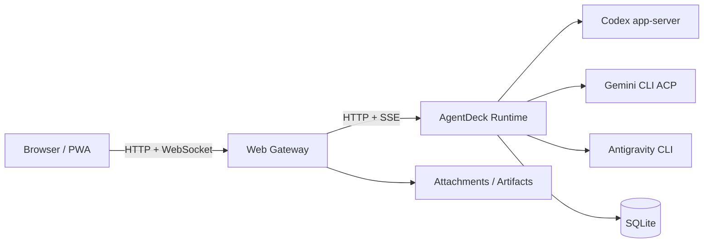

<div align="center">

# AgentDeck

**把运行在服务器上的 Coding Agent，带到浏览器和手机上。**

一个自托管、移动端优先的 Agent 控制台。<br>
集中管理 Codex、Gemini CLI 和 Antigravity，会话不会因为刷新页面或临时断线就消失。


</div>

---

## 为什么做 AgentDeck

Codex 和 Gemini CLI 很适合在服务器上长期工作，但它们天然更偏向终端：

- 离开电脑后，不方便查看任务进度或继续对话；
- 浏览器刷新、网络切换或 Web 服务重启后，流式内容容易中断；
- 多个 Provider、多个账户和多个项目分散在不同命令与配置目录中；
- 手机上临时处理审批、补充文件或继续任务并不顺手。

AgentDeck 在 CLI 和浏览器之间增加了一层持久运行时。

Agent 真正运行在服务器上，浏览器只是控制界面。你可以在电脑上创建任务，关掉页面，之后再从手机继续；页面断线重连时，AgentDeck 会根据已持久化的事件序列补发缺失内容。

## 能做什么

### 从任何设备继续任务

- 桌面与移动浏览器共用同一套 Web 界面；
- 支持安装为 PWA；
- 会话列表、搜索、重命名、归档、Fork 和删除；
- 页面刷新、浏览器重连或 Web gateway 重启后继续已有会话。

### 管理多个 Agent 和账户

- Codex app-server；
- Gemini CLI ACP；
- 可选的 Antigravity CLI；
- 每个 Provider 可维护独立 profile；
- 切换账户只影响下一轮任务，不会删除现有会话历史。

### 围绕真实项目工作

- 从允许的工作区中选择项目；
- 支持 Read Only、Workspace Write 和 YOLO 等执行模式；
- 上传图片、源码、PDF、Office 文档和压缩包；
- 查看项目 diff；
- 下载 Agent 生成的文件与其他产物。

### 保留执行状态

- Runtime 持有会话、turn、Provider thread 和事件序列；
- SQLite 持久化会话元数据与事件；
- 浏览器按 sequence 恢复缺失事件，而不是把当前页面当作事实来源；
- Provider 上游会话丢失时，可使用本地可见历史重建上下文。

## Provider 支持情况

| Provider | 接入方式 | 当前定位 |
| --- | --- | --- |
| **Codex** | `codex app-server` | AgentDeck 的主要 Provider。支持持久会话、多 profile、附件、审批和项目工作流。 |
| **Gemini CLI** | ACP over stdio | 由 Runtime 维护长期 ACP 进程，支持独立 profile、API Key 与 Google OAuth。上游 session 能否恢复取决于 Gemini CLI 暴露的能力。 |
| **Antigravity** | CLI | 适合基础文本任务。它不是 Codex runtime 的等价替代，目前不保证结构化流式事件、图片输入或长任务恢复。 |

AgentDeck 不会为 Provider 不具备的能力伪造状态。例如上游没有稳定的可机读额度接口时，界面会明确显示为不支持。

## 架构



### Browser / PWA

负责加载会话快照、发送消息、订阅流式事件并渲染界面。浏览器保存自己已经应用到的事件 sequence，重连时用它请求缺失部分。

### Web Gateway

基于 Fastify，负责：

- AgentDeck 登录；
- CSRF 与 Origin 校验；
- HTTP API 与 WebSocket；
- 附件上传和下载；
- 静态资源；
- 把浏览器请求转发给 Runtime。

### AgentDeck Runtime

Runtime 是执行状态的事实来源，负责：

- 会话和 active turn；
- Provider session / thread ID；
- Provider profile 与本轮实际执行账户；
- 事件持久化和 sequence；
- Codex app-server 与 Gemini ACP 进程生命周期；
- 向 Web Gateway 提供事件流。

更详细的设计见 [`docs/architecture.md`](docs/architecture.md)。

## 快速开始

### 环境要求

- Node.js 20 或更高版本，推荐 Node.js 22 LTS；
- npm；
- SQLite；
- OpenAI Codex CLI，并且 `codex app-server` 可用；
- 可选：支持 `--acp` 的 Gemini CLI；
- Linux 可直接使用仓库中的 systemd 示例。

### 1. 安装并构建

```bash
git clone https://github.com/razuberiii/agentdeck.git
cd agentdeck

npm install
npm run build
```

### 2. 启动 Runtime

```bash
DATA_DIR="$PWD/.data" \
RUNTIME_HOST=127.0.0.1 \
RUNTIME_PORT=3852 \
npm run runtime
```

### 3. 启动 Web Gateway

另开一个终端：

```bash
DATA_DIR="$PWD/.data" \
USE_AGENT_RUNTIME=1 \
AGENT_RUNTIME_URL=http://127.0.0.1:3852 \
ALLOWED_ORIGINS=http://localhost:3842,http://127.0.0.1:3842 \
ADMIN_PASSWORD='change-me-at-least-12-chars' \
COOKIE_SECRET='replace-with-a-stable-random-secret' \
npm start
```

打开：

```text
http://127.0.0.1:3842
```

这套命令适合本机验证。生产环境应使用独立服务账户、稳定的环境变量文件、HTTPS 和进程管理器。

## 配置

最常用的配置：

| 变量 | 默认值 | 说明 |
| --- | --- | --- |
| `HOST` | `127.0.0.1` | Web Gateway 监听地址。 |
| `PORT` | `3842` | Web Gateway 监听端口。 |
| `DATA_DIR` | `/var/lib/agentdeck` | SQLite、profiles、附件和其他运行数据的根目录。 |
| `ADMIN_PASSWORD` | 无 | AgentDeck 管理员密码，生产环境必须设置。 |
| `COOKIE_SECRET` | 启动时临时生成 | Cookie 签名密钥；生产环境必须使用稳定随机值。 |
| `ALLOWED_ORIGINS` | 本机地址 | 允许建立 WebSocket 的浏览器 Origin。 |
| `ALLOWED_WORKSPACES` | 当前目录、`/opt/projects` | UI 可选择的工作区根目录，多个路径用逗号分隔。 |
| `AGENT_RUNTIME_URL` | `http://127.0.0.1:3852` | Web Gateway 访问 Runtime 的地址。 |

<details>
<summary><strong>完整环境变量</strong></summary>

### Web Gateway

| 变量 | 默认值 | 说明 |
| --- | --- | --- |
| `HOST` | `127.0.0.1` | Web Gateway 监听地址。 |
| `PORT` | `3842` | Web Gateway 监听端口。 |
| `DATA_DIR` | `/var/lib/agentdeck` | 主数据目录。 |
| `ADMIN_PASSWORD` | 无 | 初始管理员密码。 |
| `COOKIE_SECRET` | 启动时生成 | Cookie 签名密钥。生产环境应固定。 |
| `ALLOWED_ORIGINS` | `http://localhost:3842,http://127.0.0.1:3842` | WebSocket Origin 白名单。 |
| `ALLOWED_WORKSPACES` | 当前目录、`/opt/projects` | 可访问的工作区根目录。 |
| `USE_AGENT_RUNTIME` | 未启用 | 设为 `1` 后通过持久 Runtime 执行会话。 |
| `AGENT_RUNTIME_URL` | `http://127.0.0.1:3852` | Runtime 地址。 |
| `AGENT_RUNTIME_TOKEN` | 未设置 | Web Gateway 调用 Runtime 时使用的 Bearer token。 |

### Runtime

| 变量 | 默认值 | 说明 |
| --- | --- | --- |
| `RUNTIME_HOST` | `127.0.0.1` | Runtime 监听地址。 |
| `RUNTIME_PORT` | `3852` | Runtime 监听端口。 |
| `RUNTIME_TOKEN` | 未设置 | Runtime 非 loopback 监听时必须设置。 |
| `RUNTIME_DB` | `$DATA_DIR/agentdeck-runtime.sqlite3` | Runtime SQLite 数据库。 |

### Provider

| 变量 | 默认值 | 说明 |
| --- | --- | --- |
| `CODEX_HOME` | `$HOME/.codex` | Codex profile 与配置目录。 |
| `GEMINI_BIN` | `/usr/bin/gemini` | Gemini CLI 路径。 |
| `GEMINI_ACP_ARGS` | `--acp` | Gemini ACP 启动参数。 |
| `GEMINI_PROFILE_ROOT` | `$DATA_DIR/gemini/profiles/default` | Gemini 默认 profile 根目录。 |
| `ANTIGRAVITY_BIN` | `agy` | Antigravity CLI 命令或路径。 |

### 附件

| 变量 | 默认值 | 说明 |
| --- | --- | --- |
| `MAX_ATTACHMENT_BYTES` | `33554432` | 单个附件大小上限。 |
| `MAX_ATTACHMENTS_PER_MESSAGE` | `10` | 单条消息附件数量上限。 |
| `MAX_TOTAL_ATTACHMENT_BYTES` | `67108864` | 单条消息附件总大小建议上限。 |

</details>

## Gemini CLI

AgentDeck Runtime 使用 ACP 管理长期 Gemini CLI 子进程。每个 Gemini profile 使用独立的 `HOME` 与 `GEMINI_CONFIG_DIR`，凭据不会写进浏览器或消息正文。

Web 登录目前支持：

- Gemini API Key；
- Google OAuth。

API Key 只写入对应 profile 的 `agentdeck.env`，权限为 `0600`。Google OAuth 通过独立 PTY 完成授权，并在凭据落盘后初始化该 profile 的 ACP runtime。

需要注意：

- Web Gateway 重启不会主动终止 Runtime 中的 Gemini ACP 进程；
- Runtime 整体重启时，不承诺无损恢复正在执行的 turn；
- Gemini CLI 支持 `session/load` 时，AgentDeck 会尝试恢复上游 session；
- 加载失败时会新建上游 session，并使用 AgentDeck 本地历史继续；
- 切换默认 Gemini profile 后，现有 AgentDeck 会话仍然保留，但下一轮由新 profile 执行。

## 附件与产物

附件通过 `multipart/form-data` 上传到 Web root 之外的 `attachments/` 目录。

服务端不会信任浏览器传入的文件路径、MIME、大小或文件名，而是使用内部随机 ID 和独立 metadata。图片可以显示缩略图，PDF 和安全文本可预览；Office、压缩包和未知二进制默认下载，并设置 `X-Content-Type-Options: nosniff`。

不同 Provider 的传递方式不同：

- **Codex**：图片使用原生本地图片输入，普通文件以受控本地路径和 metadata 提供；
- **Gemini**：优先使用 ACP resource link 或 image block，取决于初始化能力；
- **Antigravity**：以本地路径提供给 CLI。

备份时不要只复制 SQLite，还需要保留 `attachments/` 和生成产物目录。

## 生产部署

推荐的生产结构：

```text
Internet
   |
HTTPS reverse proxy
   |
AgentDeck Web Gateway (127.0.0.1:3842)
   |
AgentDeck Runtime (127.0.0.1:3852)
   |
Provider processes
```

至少应做到：

- 使用 Nginx、Caddy 或 Traefik 提供 HTTPS；
- Web Gateway 与 Runtime 默认只监听 loopback；
- 环境变量文件放在 Git 工作树之外；
- 使用 systemd 或其他进程管理器；
- 反向代理正确转发 WebSocket upgrade；
- `ALLOWED_ORIGINS` 只包含实际使用的 HTTPS 域名。

仓库中的 systemd 示例位于 [`deploy/systemd/`](deploy/systemd/)。

如果 Runtime 必须监听非 loopback 地址，请在两侧设置同一个强随机 token：

```bash
RUNTIME_TOKEN=replace-with-random-token
AGENT_RUNTIME_TOKEN=replace-with-random-token
```

不要把 Codex app-server 直接暴露到公网。

## 数据与备份

需要备份整个 `DATA_DIR`。关键内容包括：

```text
agentdeck.sqlite3
agentdeck-runtime.sqlite3
profiles/
gemini/profiles/
antigravity-profiles/
shared/sessions/
shared/generated_images/
attachments/
```

SQLite 服务运行期间可能存在 `-wal` 和 `-shm` 文件。建议使用 SQLite 的 `.backup` 命令，或者停止相关服务后再复制数据库。

环境文件、Cookie secret、Provider token 和登录凭据不要提交到公开仓库。

## 恢复边界

AgentDeck 的目标是让浏览器断线不等于任务丢失，但它不是分布式事务系统。

可以恢复的情况：

- 页面刷新；
- 浏览器临时断网；
- WebSocket 重连；
- Web Gateway 重启；
- 已经持久化的事件补发。

不能完全保证的情况：

- Runtime 在 active turn 中崩溃；
- Provider 进程被系统强制终止；
- 高频 delta 尚未写入 SQLite 时发生极端故障；
- 上游 CLI 删除或不再识别原 session / thread。

当上游 thread 不存在时，AgentDeck 可以创建替代 thread，并使用本地可见历史继续，但 Provider 内部未展示的隐藏状态无法保证恢复。

## 开发

```bash
npm install

npm run build
npm run typecheck
npm run lint
npm test
npm run test:e2e
```

开发模式：

```bash
npm run dev
npm run dev:runtime
```

单独构建：

```bash
npm run build:server
npm run build:client
```

## 项目状态

AgentDeck 仍在快速迭代。Provider CLI 的协议和行为可能变化，升级 Codex CLI 或 Gemini CLI 后，建议先在非生产环境验证登录、创建会话、继续会话、附件和恢复流程。

## License

仓库目前还没有 `LICENSE` 文件。

公开源代码并不自动授予复制、修改或分发权。如果准备让其他人正式使用或参与贡献，建议补充一个明确的开源许可证。
