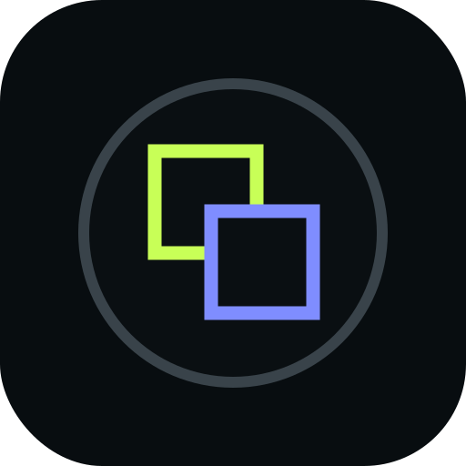
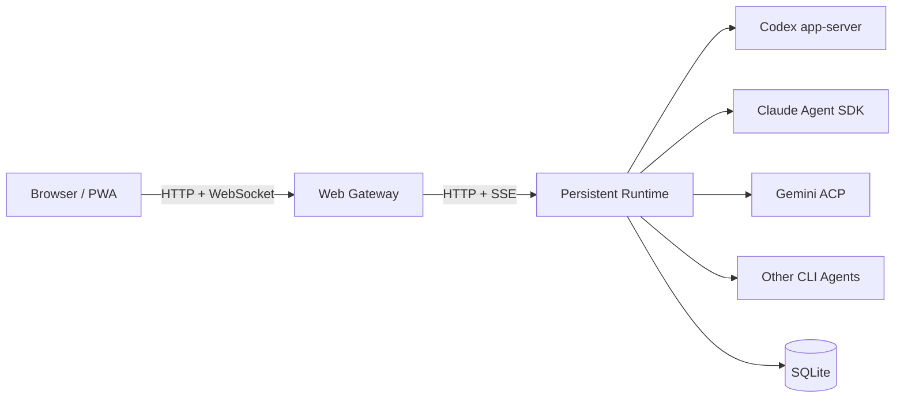

<div align="center">



# AgentDeck

**让服务器里的 Coding Agent，变成一个随时可以回来的工作空间。**

在电脑上交代任务，在路上用手机查看进度。页面关掉、网络断开或换一台设备，任务仍在自己的服务器上继续。

[安装](#开始使用) · [工作原理](#工作原理) · [Provider](#provider) · [文档](#文档)

</div>

## 为什么做它

我喜欢把 Coding Agent 放在服务器里跑：环境完整、项目都在、任务也不怕笔记本合盖。但终端并不是一个适合随时回来查看、补一句话或处理审批的界面。

AgentDeck 是我希望拥有的那层产品界面。它不搬走代码，也不接管 Agent；它只是把服务器里真实运行的 CLI Agent、账号、项目和会话整理成一个桌面与手机都舒服的工作空间。

它适合这样的使用方式：

- 发出一个任务，然后离开页面；
- 从另一台设备继续同一段对话；
- 保存多个 Agent 账号，并在需要时切换；
- 上传截图、源码、PDF，查看产物与执行过程；
- 自己掌握代码、凭据、数据库和运行环境。

## 现在能做什么

- **持久任务**：Web 页面重启不等于任务重启，Runtime 会保存会话和事件序列。
- **多 Agent 工作区**：统一使用 Codex、Claude Code、Gemini CLI 与 Antigravity。
- **多账号状态**：保存 Provider 账号、切换当前账号，并把会话绑定到实际执行账号。
- **跨设备继续**：桌面浏览器与手机 PWA 使用同一份任务状态。
- **真实执行过程**：查看回复、命令、审批、附件和任务状态，而不是只保留聊天文本。
- **自托管**：项目、凭据、附件和 SQLite 数据都留在自己的机器上。

## 开始使用

需要 Linux 与 Node.js 22 或更高版本。推荐放在 localhost、可信局域网、VPN、Tailscale、Headscale 或 WireGuard 后面；不要把未加防护的 AgentDeck 直接暴露到公网。

```bash
git clone https://github.com/razuberiii/agentdeck.git
cd agentdeck
sudo AGENTDECK_INSTALL_PROFILE=standard ./install.sh
```

安装脚本会输出访问地址。打开页面后进入 **设置 → Agent 与账号**，完成 CLI 登录即可开始任务。

如果你是在自己的可信服务器上，希望保持完整权限：

```bash
sudo AGENTDECK_INSTALL_PROFILE=personal ./install.sh
```

| Profile | 适用环境 | 默认权限 |
| --- | --- | --- |
| `standard` | 大多数自托管安装 | 专用用户，`workspace-write`，操作时确认 |
| `personal` | 个人服务器、VPN、可信内网 | 当前用户，`danger-full-access`，无需确认 |
| `hardened` | 希望自行配置安全边界 | `read-only`，操作时确认 |

完整安装与升级说明见 [docs/install.md](docs/install.md)。

## Provider

| Provider | 当前定位 |
| --- | --- |
| **Codex** | 主力接入；支持持久会话、审批、附件、多账号和账号绑定。 |
| **Claude Code** | 通过官方 CLI 与 Claude Agent SDK 运行。 |
| **Antigravity** | 基础 CLI Agent 接入，能力取决于上游。 |
| **Gemini CLI** | 实验性接入；个人账号能力可能受上游客户端限制。 |

AgentDeck 不假装所有 Provider 完全相同。界面会根据实际 CLI、登录状态与 Runtime 能力告诉你当前可以创建或继续什么任务。

## 工作原理



浏览器是控制面，Runtime 才是任务的事实来源。会话、活动 Turn、执行账号和有序事件会被持久化；浏览器重新连接后从最后确认的位置继续补事件。

这也意味着升级 Web 界面时，不需要打断正在工作的 Agent。涉及 Runtime 的发布会先等待活动任务安全结束，再完成切换。

## 运维

最省心的升级方式是拉取代码后只发布发生变化的部分：

```bash
git pull
sudo scripts/deploy.sh --deploy --changed
```

命令会先构建并跑检查，再创建可回滚的 Release。只有 Web 变化时不会重启 Runtime；涉及 Runtime 且仍有任务运行时，发布任务会等待安全切换。提交后终端会给出 Job ID，可用 `sudo agentdeckctl job <Job ID>` 查看进度。

日常只需要记住下面几条：

```bash
sudo agentdeckctl status          # 服务与当前发布
sudo agentdeckctl check           # 环境检查
sudo scripts/deploy.sh --deploy --changed # 按代码变化安全发布
sudo agentdeckctl jobs            # 发布任务
sudo agentdeckctl rollback all    # 回滚
sudo agentdeckctl backup          # 备份
```

如果明确只改了界面，可以用 `sudo scripts/deploy.sh --deploy --components web`。`--force` 会中断活动任务，除非正在处理故障，否则不要使用。

## 开发

```bash
npm ci
npm run start:local
```

提交前建议运行：

```bash
npm run typecheck
npm run lint
npm run build
npm test
npm run test:e2e
```

## 文档

- [架构](docs/architecture.md)
- [安装与升级](docs/install.md)
- [Provider 与登录](docs/providers.md)
- [安全边界](docs/security.md)
- [备份与恢复](docs/backup-restore.md)
- [故障排查](docs/troubleshooting.md)

## 项目状态

AgentDeck 还在快速演进。CLI、认证方式和上游协议会变化，某些 Provider 能力也仍然有限。如果你遇到问题，欢迎带上环境信息和复现步骤提交 Issue。

MIT License。见 [LICENSE](LICENSE)。
